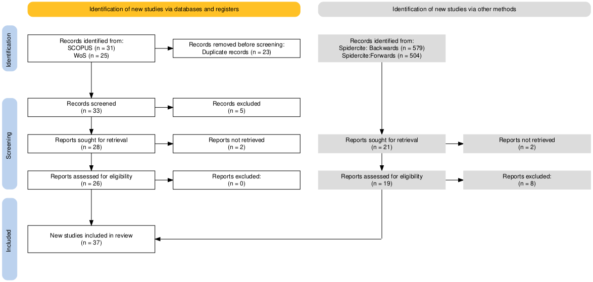

[](https://opensource.org/licenses/MIT)

<div align="left">
  
</div>

# SCOPE: Simulation for Coordination of Orthopaedic Patient Elective Services

This repository serves as supplementary material for the paper:

>**Mapping Applications of Computer Simulation in Orthopedic Services: A Topic Modeling Approach**. 

 **This work has been supported by the LEAP Digital Health Hub,
which has been funded by EPSRC under grant number EP/X031349/1**


The paper used a topic modelling approach to examine and map the computational simulation literature applied to operational-level orthopedics services, combined with a structured analysis of the papers.

## Running the analysis

To run the files, clone or download the project, open the project in R and run:

```
renv::restore()
```

This will install the package versions recorded in the renv.lock file.


## Authors

* Thomas Monks &nbsp;&nbsp; [](https://orcid.org/0000-0003-2631-4481)

* Alison Harper &nbsp;&nbsp; [](https://orcid.org/0000-0001-5274-5037)

* Navonil Mustafee &nbsp;&nbsp; [](https://orcid.org/0000-0001-5274-5037)

* Jonathan T. Evans &nbsp;&nbsp; [](https://orcid.org/0000-0002-9464-6261)

* Al-Amin Kassam &nbsp;&nbsp; [](https://orcid.org/0000-0002-7926-3289)

## Search methods

### Table: Database Search Strings

| **Database**     | **Search String**                                                                                                                                                                                                                                                                                                                                                                                                                                                                                                                                                                                                                                                                                                                                 | **Returned** |
|-------------------|-----------------------------------------------------------------------------------------------------------------------------------------------------------------------------------------------------------------------------------------------------------------------------------------------------------------------------------------------------------------------------------------------------------------------------------------------------------------------------------------------------------------------------------------------------------------------------------------------------------------------------------------------------------------------------------------------------------------------------------------------------|--------------|
| **SCOPUS**        | ( ABS ( simulation ) AND ABS ( "system dynamics" OR "agent based" OR "discrete event" OR "stochastic") AND ABS ( health* OR hospital OR patient ) AND ABS ( orthopaedic* OR orthopedic* OR fracture OR arthroplasty ) )AND ABS("operational processes" OR "service quality" OR appointment* OR "capacity allocation" OR "theatre allocation" OR "capacity management" OR "capacity planning" OR "hospital management" OR "care access" OR "care pathway*" OR "critical pathway*" OR "demand management" OR "flow of care" OR "flow of patients" OR "integrated pathway" OR "patient flow" OR "surgical flow" OR "patient pathway*" OR "patient process*" OR "department process*" OR "hospital process*" OR "waiting time*" OR "patient route" OR "patient throughput" OR "process flow") AND PUBYEAR > 2003 AND PUBYEAR < 2026 AND ( LIMIT-TO ( LANGUAGE,"English" ) ) | 31           |
| **Web of Science** | ((AB=(simulation) AND AB= ("system dynamics" OR "agent based" OR "discrete event" OR "stochastic") AND AB=("operational processes" OR "service quality" OR appointment* OR "capacity allocation" OR "theatre allocation" OR "capacity management" OR "capacity planning" OR "hospital management" OR "care access" OR "care pathway*" OR "critical pathway*" OR "demand management" OR "flow of care" OR "flow of patients" OR "integrated pathway" OR "patient flow" OR "surgical flow" OR "patient pathway*" OR "patient process*" OR "department process*" OR "hospital process*" OR "waiting time*" OR "patient route" OR "patient throughput" OR "process flow") AND AB=(health* OR hospital OR patient) AND AB=(orthopaedic* OR orthopedic* OR fracture OR arthroplasty))) AND ((LA==("ENGLISH")) NOT (PY==("2002" OR "2003" OR "2001" OR "2000" OR "1999" OR "1998" OR "1997" OR "1996" OR "1995" OR "1994" OR "1993" OR 1991"))) | 25           |


<br>
<br>

### PRISMA compliant workflow



<br>
PRISMA compliant flow diagram (Haddaway et al. 2022)

<br>

Haddaway NR, Page MJ, Pritchard CC, McGuinness LA. PRISMA2020: An R package and Shiny app for producing PRISMA 2020-compliant flow diagrams, with interactivity for optimised digital transparency and Open Synthesis. Campbell Syst Rev. 2022 Mar 27;18(2):e1230. doi: 10.1002/cl2.1230.

<br>

### Inclusion/exclusion criteria

| **Inclusion criteria**                                             | **Exclusion criteria**                                              |
|--------------------------------------------------------------------|---------------------------------------------------------------------|
| Full text                                                          | Cost-effectiveness studies                                            |
| Operational-level service evaluation or improvement                | Long-term demand/burden of care predictions                           |
| Primary method is simulation (ABS, DES, SD)                        | System/regional-level policy models                                   |
| Academic journals and conferences                                  | Medical case/education simulation                                     |
| English language                                                   | Simulation of component failure                                       |
| Years limited to 2004–2025 (part year)                               | Simulation of hospital or department infrastructure                     |


### Documents included in analysis

Topic modeling is an unsupervised machine learning technique that identifies underlying themes or topics
in large text datasets by grouping related words and concepts. Topic modeling was performed using Latent
Dirichlet Allocation (LDA), implemented via Gibbs sampling in R v4.4.2. Dominant topics per document are included in the table below. 

| Citation                                                                                                                                                                                                                                                                                                                                                      |   topic |
|:--------------------------------------------------------------------------------------------------------------------------------------------------------------------------------------------------------------------------------------------------------------------------------------------------------------------------------------------------------------|--------:|
| Anderson,  Jenkins,  McDonald,  Van Der Meer,  Morton,  Nugent,  Rymaszewski (2017). Cost comparison of orthopaedic fracture pathways using discrete event simulation in a Glasgow hospital.. *BMJ open*.                                                                                                                                                     |       3 |
| Baril,  Gascon,  Cartier (2014). Design and analysis of an outpatient orthopaedic clinic performance with discrete event simulation and design of experiments. *Computers & Industrial Engineering*.                                                                                                                                                          |       1 |
| Bowers,  Mould (2004). Managing uncertainty in orthopaedic trauma theatres. *European Journal of Operational Research*.                                                                                                                                                                                                                                       |       2 |
| Boyle,  Mackay (2022). A Reusable Discrete Event Simulation Model for Improving Orthopedic Waiting Lists. *2022 Winter Simulation Conference (WSC)*.                                                                                                                                                                                                          |       3 |
| Chen,  Li,  Kazunobu,  Ken,  Shinji,  Miao (2010). Impact of adjustment measures on reducing outpatient waiting time in a community hospital: application of a computer simulation. *Chinese Medical Journal*.                                                                                                                                                |       1 |
| Comans,  Chang,  Standfield,  Knowles,  O'Leary,  Raymer (2017). The development and practical application of a simulation model to inform musculoskeletal service delivery in an Australian public health service. *Operations Research for Health Care*.                                                                                                    |       3 |
| Dehlendorff,  Kulahci,  Andersen (2010). Analysis of computer experiments with multiple noise sources. *Quality and Reliability Engineering International*.                                                                                                                                                                                                   |       2 |
| Dehlendorff,  Kulahci,  Merser,  Andersen (2010). Conditional Value at Risk as a Measure for Waiting Time in Simulations of Hospital Units. *QUALITY TECHNOLOGY AND QUANTITATIVE MANAGEMENT*.                                                                                                                                                                 |       2 |
| Ferrand,  Magazine,  Rao (2014). Partially flexible operating rooms for elective and emergency surgeries. *Decision Sciences*.                                                                                                                                                                                                                                |       2 |
| Harper,  Monks,  Wilson,  Redaniel,  Eyles,  Jones,  Penfold,  Elliott,  Keen,  Pitt,  Blom,  Whitehouse,  Judge (2023). Development and application of simulation modelling for orthopaedic elective resource planning in England.. *BMJ open*.                                                                                                              |       3 |
| Harper,  Pitt,  Monks (2023). Open-Source Modeling for Orthopedic Elective Capacity Planning using Discrete-Event Simulation. *2023 Winter Simulation Conference (WSC)*.                                                                                                                                                                                      |       3 |
| He,  Li,  Sala-Diakanda,  Sepulveda,  Bozorgi,  Karwowski (2013). A hybrid modeling and simulation methodology for formulating overbooking policies. *IIE Annual Conference and Expo 2013*.                                                                                                                                                                   |       1 |
| Johnson,  Kiernan,  Swan,  Botwick,  Spier,  White,  Valdez,  Kang,  Lobo (2016). Designing patient throughput and task management innovations in orthopaedics. *2016 IEEE Systems and Information Engineering Design Symposium (SIEDS)*.                                                                                                                     |       1 |
| Kittipittayakorn,  Ying (2016). Using the Integration of Discrete Event and Agent-Based Simulation to Enhance Outpatient Service Quality in an Orthopedic Department.. *Journal of healthcare engineering*.                                                                                                                                                   |       1 |
| Komashie,  Mousavi,  Gore (2008). Using Discrete Event Simulation (DES) to Manage Theatre Operations in Healthcare: An Audit-based Case Study. *2008 UKSIM TENTH INTERNATIONAL CONFERENCE ON COMPUTER MODELING AND SIMULATION*.                                                                                                                               |       2 |
| Ltaif,  Ammar,  Khrifch (2022). A goal programming approach based on simulation and optimization to serve patients in an external orthopedic department. *Journal of Simulation*.                                                                                                                                                                             |       1 |
| Lu,  Kittipittayakorn,  Shih,  Lian (2013). CSCWD - Improving outpatient service quality in department of orthopedic surgery by using collaborative approaches. *Proceedings of the 2013 IEEE 17th International Conference on Computer Supported Cooperative Work in Design (CSCWD)*.                                                                        |       1 |
| Lu,  Tsai,  Chu (2014). CSCWD - An agent-based collaborative model for orthopedic outpatient scheduling. *Proceedings of the 2014 IEEE 18th International Conference on Computer Supported Cooperative Work in Design (CSCWD)*.                                                                                                                               |       1 |
| Montgomery,  Linville,  Slonim (2013). Desktop Microsimulation: A Tool to Improve Efficiency in the Medical Office Practice. *JOURNAL FOR HEALTHCARE QUALITY*.                                                                                                                                                                                                |       1 |
| Moretto,  Comans,  Chang,  O'Leary,  Osborne,  Carter,  Smith,  Cavanagh,  Blond,  Raymer (2019). Implementation of simulation modelling to improve service planning in specialist orthopaedic and neurosurgical outpatient services. *Implementation science : IS*.                                                                                          |       3 |
| Persson,  Hvitfeldt-Forsberg,  Unbeck,  Skoldenberg,  Stark,  Kelly-Pettersson,  Mazzocato (2017). Operational strategies to manage non-elective orthopaedic surgical flows: a simulation modelling study. *BMJ open*.                                                                                                                                        |       2 |
| Persson,  Persson (2010). Analysing management policies for operating room planning using simulation. *HEALTH CARE MANAGEMENT SCIENCE*.                                                                                                                                                                                                                       |       2 |
| Pu,  Wu,  Han (2024). A discrete-event simulation model for assessing operating room efficiency of thoracic, gastrointestinal, and orthopedic surgeries. *WORLD JOURNAL OF SURGERY*.                                                                                                                                                                          |       2 |
| Rachuba,  Knapp,  Ashton,  Pitt (2018). Streamlining pathways for minor injuries in emergency departments through radiographer-led discharge. *OPERATIONS RESEARCH FOR HEALTH CARE*.                                                                                                                                                                          |       3 |
| Reese,  Avansino,  Brumm,  Martin,  Day (2020). Determining future capacity for an Ambulatory Surgical Center with discrete event simulation. *International Journal of Healthcare Management*.                                                                                                                                                               |       1 |
| Rohleder,  Lewkonia,  Bischak,  Duffy,  Hendijani (2010). Using simulation modeling to improve patient flow at an outpatient orthopedic clinic.. *Health care management science*.                                                                                                                                                                            |       1 |
| Saadouli,  Ltaif (2020). Evaluating the impact of human resource management on the patient flow at an outpatient orthopedic clinic. *International Journal of Healthcare Management*.                                                                                                                                                                         |       1 |
| Simwita,  Helgheim (2016). Improving surgeon utilization in an orthopedic department using simulation modeling.. *Journal of healthcare leadership*.                                                                                                                                                                                                          |       3 |
| Simwita,  Helgheim (2016). Simulation analysis of resource flexibility on healthcare processes. *JOURNAL OF MULTIDISCIPLINARY HEALTHCARE*.                                                                                                                                                                                                                    |       3 |
| Standfield,  Comans,  Scuffham (2015). An empirical comparison of Markov cohort modeling and discrete event simulation in a capacity-constrained health care setting. *The European journal of health economics : HEPAC : health economics in prevention and care*.                                                                                           |       3 |
| Standfield,  Comans,  Raymer,  O'Leary,  Moretto,  Scuffham (2016). The Efficiency of Increasing the Capacity of Physiotherapy Screening Clinics or Traditional Medical Services to Address Unmet Demand in Orthopaedic Outpatients: A Practical Application of Discrete Event Simulation with Dynamic Queuing. *APPLIED HEALTH ECONOMICS AND HEALTH POLICY*. |       3 |
| Steins,  Persson,  Holmer (2010). Increasing Utilization in a Hospital Operating Department Using Simulation Modeling. *SIMULATION*.                                                                                                                                                                                                                          |       2 |
| Suhaimi,  Vahdat,  Griffin (2018). BUILDING A FLEXIBLE SIMULATION MODEL FOR MODELING MULTIPLE OUTPATIENT ORTHOPEDIC CLINICS. *2018 Winter Simulation Conference (WSC)*.                                                                                                                                                                                       |       1 |
| Vahdat,  Griffin,  Burns,  Azghandi (2017). Proactive patient flow redesign for integration of multiple outpatient clinics. *Proceedings - Winter Simulation Conference*.                                                                                                                                                                                     |       1 |
| Vahdat,  Namin,  Azghandi,  Griffin (2019). Improving patient timeliness of care through efficient outpatient clinic layout design using data-driven simulation and optimisation. *Health Systems*.                                                                                                                                                           |       1 |
| van,  Rymaszewski,  Findlay,  Curran (2005). Using OR to support the development of an integrated musculo-skeletal service. *JOURNAL OF THE OPERATIONAL RESEARCH SOCIETY*.                                                                                                                                                                                    |       3 |
| Weerawat,  Pichitlamken,  Subsombat (2013). A Generic Discrete-Event Simulation Model for Outpatient Clinics in a Large Public Hospital. *Journal of healthcare engineering*.                                                                                                                                                                                 |       1 |